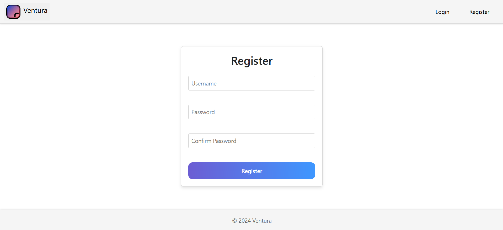
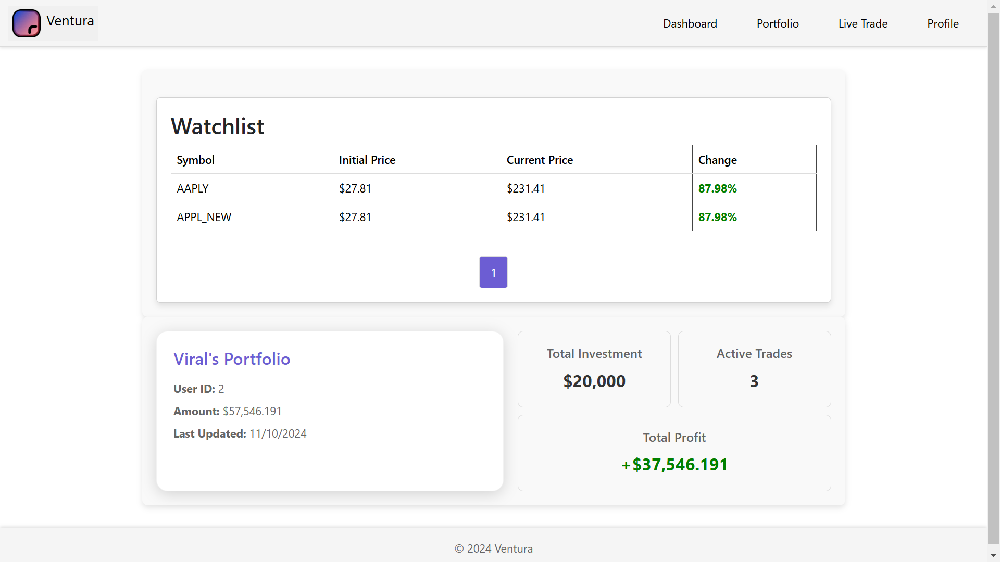
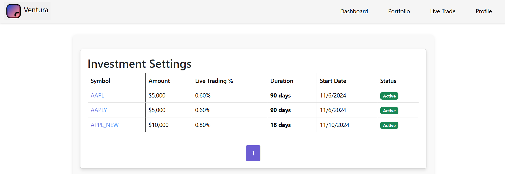

# Ventura

Ventura is a Django-based full stack web application for a trading. It provides a rich user intefrace portfolio management, trading, and more with secuirty. The ventura also integrates with Celery for asynchronous task processing and uses Redis as the message broker.

## Table of Contents

- [Installation](#installation)
- [Configuration](#configuration)
- [Running the Application](#running-the-application)
- [Celery Tasks](#celery-tasks)
- [Frontend Integration](#frontend-integration)
- [Security](#security)
- [Screenshots](#screenshots)
- [Contributing](#contributing)
- [License](#license)

## Installation

1. Clone the repository:
    ```bash
    git clone https://github.com/ViralBiyawala/Ventura
    cd ventura
    ```

2. Create and activate a virtual environment:
    ```bash
    python -m venv venv
    source venv/bin/activate  # On Windows use `venv\Scripts\activate`
    ```

3. Install the required packages:
    ```bash
    pip install -r requirements.txt
    ```

4. Move to the backend directory:
    ```bash
    cd ventura_backend
    ```

5. Set up the database:
    ```bash
    python manage.py migrate
    ```

6. Create a superuser:
    ```bash
    python manage.py createsuperuser
    ```

## Configuration

1. Update the `settings.py` file with your configurations:
    ```python
    # filepath: /f:/Ventura/ventura_backend/ventura_backend/settings.py
    # ...existing code...
    CORS_ALLOW_ALL_ORIGINS = True
    # ...existing code...
    SIMPLE_JWT = {
        'ACCESS_TOKEN_LIFETIME': timedelta(days=5),
        'REFRESH_TOKEN_LIFETIME': timedelta(days=14),
    }
    # ...existing code...
    CELERY_BROKER_URL = 'redis://localhost:6379/0'
    CELERY_RESULT_BACKEND = 'redis://localhost:6379/0'
    CELERY_ACCEPT_CONTENT = ['json']
    CELERY_TASK_SERIALIZER = 'json'
    CELERY_RESULT_SERIALIZER = 'json'
    CELERY_TIMEZONE = 'UTC'
    ```

2. Set up environment variables for Alpaca API in a `.env` file:
    ```env
    ALPACA_API_KEY=your_alpaca_api_key
    ALPACA_API_SECRET=your_alpaca_api_secret
    ```

## Running the Application
## Running the Application

1. Start the Redis server in a new terminal:
    ```bash
    redis-server.exe path\to\redis.windows.conf
    ```
2. Start the Django development server in another new terminal:
    ```bash
    python manage.py runserver
    ```
3. Start the Celery worker in yet another new terminal:
    ```bash
    celery -A ventura_backend worker --loglevel=info
    ```

## Celery Tasks

Celery is used for asynchronous task processing. The tasks are defined in the `tasks.py` file and can be triggered via API endpoints.

### Task: Start Trading

The `start_trading_task` function in `tasks.py` is used to start the trading process asynchronously. It ensures the user profile exists and then calls the `start_trading` function from the `src.main` module.

## Frontend Integration

The frontend is integrated with the backend using Django templates and static files. The main entry point for the frontend is the `index.html` file located in the `templates` directory.

### JavaScript Modules

- **register.js:** Handles user registration.
- **login.js:** Handles user login.
- **portfolio.js:** Fetches and visualizes user portfolio data.
- **profile.js:** Manages user profile, including fetching and deleting profile data.
- **liveTrade.js:** Fetches and visualizes live trade data.
- **dashboard.js:** Displays investment settings and handles trade initiation.

## Security

To enhance security, Ventura Backend uses JWT (JSON Web Token) for user authentication. JWT tokens are issued upon successful login and must be included in the Authorization header of subsequent API requests. This ensures that only authenticated users can access protected endpoints.

## Screenshots
- **Register:**


- **Portfolio:**


- **Trading Records:**


## Contributing

Contributions are welcome! Please follow these steps to contribute:

1. Fork the repository.
2. Create a new branch.
3. Make your changes.
4. Submit a pull request.

## License

This project is licensed under the MIT License. See the [LICENSE](LICENSE) file for more details.